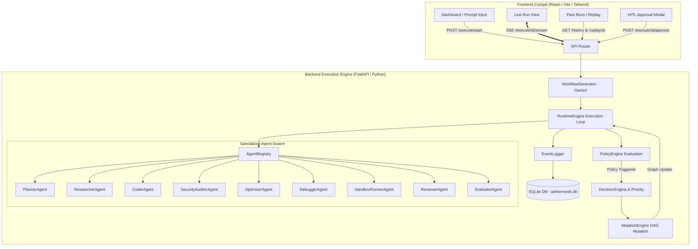

# 🕸️ AetherMesh — Adaptive Multi-Agent AI Runtime Kernel

> **Ctrl Alt Defeat** | Hackathon Entry  
> **Team Members:** Advaith Suriyanarayanan · K V Lokesh Kumar · Viswa Danuskka · Sinduja U V

---

## 💡 What is AetherMesh?

**AetherMesh** is an **adaptive multi-agent execution kernel** that solves the biggest vulnerability in multi-agent AI systems: **brittleness and unmonitored failure compounding**.

When traditional AI agent pipelines run, a single hallucination, low-confidence output, or missing repository resource can cause the entire system to fail silently. 

AetherMesh acts as a **runtime operating system for AI agents**:
* 🔍 **Monitors** multi-agent execution in real time via Server-Sent Events (SSE).
* 🛡️ **Evaluates Safety Policies** after every agent step (low confidence, contradiction detection, missing resources, low sources, execution timeouts).
* ↻ **Dynamically Mutates DAG Workflows** live during execution (node additions, substitutions, or deletions).
* 🛑 **Human-in-the-Loop (HITL) Controls**: Suspends high-risk graph mutations for human operator approval (`[Approve Mutation]`, `[Abort Run]`).
* 💾 **Frame-by-Frame Execution Replay**: Persists all runs in SQLite (`aethermesh.db`), allowing any past run to be replayed step-by-step.

---

## 🏗️ System Architecture



---

## ✨ Key Features

### 1. 🧠 Dynamic Workflow Planning
Powered by **Google Gemini**, the `WorkflowGenerator` analyzes plain-text task prompts, classifies the domain (`cybersecurity`, `performance`, `web development`), and constructs an ordered DAG workflow.

### 2. 🛡️ Policy Engine & Self-Healing Mutations
After each agent finishes, the `PolicyEngine` evaluates safety rules:
* **Low Confidence Policy:** Substitutes low-confidence agents with specialized retry/debugging agents.
* **Contradiction Policy:** Halts execution if conflicting evidence is discovered across agents.
* **Missing Repository Policy:** Flags unresolvable resources before agents act on them.
* **Low Sources Policy:** Dynamically injects additional research steps when data is sparse.
* **Execution Timeout Policy:** Removes stuck nodes exceeding allotted time limits.

### 3. 🤖 Specialized Domain Agent Swarm
* 🛠️ **`DebuggerAgent`**: Analyzes failure traces and generates automated hotfix code patches.
* 🔒 **`SecurityAuditorAgent`**: Performs OWASP vulnerability scanning, secrets exposure checks, and IAM policy audits.
* ⚡ **`OptimizerAgent`**: Profiles algorithmic complexity, memory leaks, and goroutine pools.
* 🧪 **`SandboxRunnerAgent`**: Verifies generated code patches inside isolated container/execution environments.
* 📝 **`PlannerAgent`**, **`ResearcherAgent`**, **`CoderAgent`**, **`ReviewerAgent`**, **`EvaluatorAgent`**.

### 4. 🛑 Human-in-the-Loop (HITL) Interventions
When high-risk policy mutations occur, execution enters a `paused_for_approval` state. The UI renders glowing intervention controls allowing human operators to approve mutations or abort execution live via `POST /execute/{id}/approve`.

### 5. 💾 Replayable Audit Trails & SQLite Persistence
Every execution state, confidence metric, and event log is persisted to SQLite (`aethermesh.db`). Navigate to **Past Runs** (`/runs`) or **Replay** (`/replay`) to inspect any past run frame-by-frame.

---

## 🚀 Quick Start Guide

### Prerequisites
* **Python 3.10+**
* **Node.js 18+** & **npm**

---

### 1. Backend Setup

```bash
# Navigate to backend directory
cd backend

# Create and activate virtual environment (optional)
python -m venv venv
source venv/bin/activate  # On Windows: venv\Scripts\activate

# Install dependencies
pip install -r requirements.txt

# Configure Gemini API Key in .env
cp .env.example .env
```

Edit `backend/.env` and insert your Gemini API Key:
```env
GEMINI_API_KEY=your_actual_gemini_api_key_here
GEMINI_MODEL=gemini-2.5-flash
```

Start the FastAPI backend server:
```bash
python -m uvicorn app:app --reload --port 8000
```
> The API server will be available at `http://localhost:8000`. Health check: `http://localhost:8000/health`.

---

### 2. Frontend Setup

In a new terminal window:

```bash
# Navigate to frontend directory
cd frontend

# Install dependencies
npm install

# Start Vite development server
npm run dev
```
> The frontend application will be live at `http://localhost:5173`.

---

## 🧪 Sample Prompts to Test

Try entering these prompts in the UI prompt input box (`http://localhost:5173/prompt`):

1. **Security Infrastructure Audit:**
   > `Scan AWS Terraform infrastructure definitions for open S3 buckets and exposed IAM keys`
2. **Concurrency & Memory Leak Debugging:**
   > `Audit a Golang gRPC microservice for unhandled goroutine leaks and race conditions`
3. **Vulnerability Detection:**
   > `Detect SQL injection vulnerabilities in legacy Express API endpoints`
4. **CI/CD Self-Healing Test:**
   > `Diagnose the failing checkout-service CI pipeline and ship a fix`

---

## 👥 Team — Ctrl Alt Defeat

* **Advaith Suriyanarayanan**
* **K V Lokesh Kumar**
* **Viswa Danuskka**
* **Sinduja U V**
